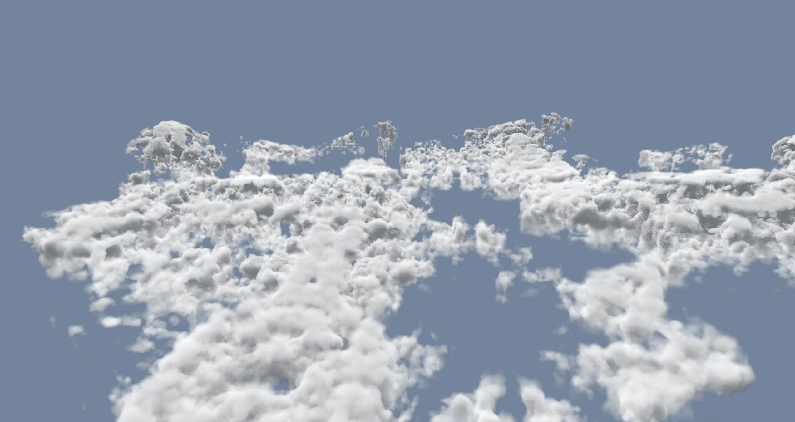
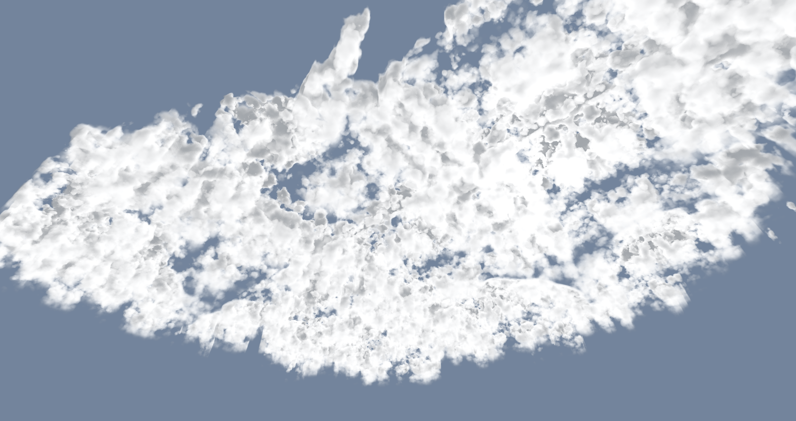
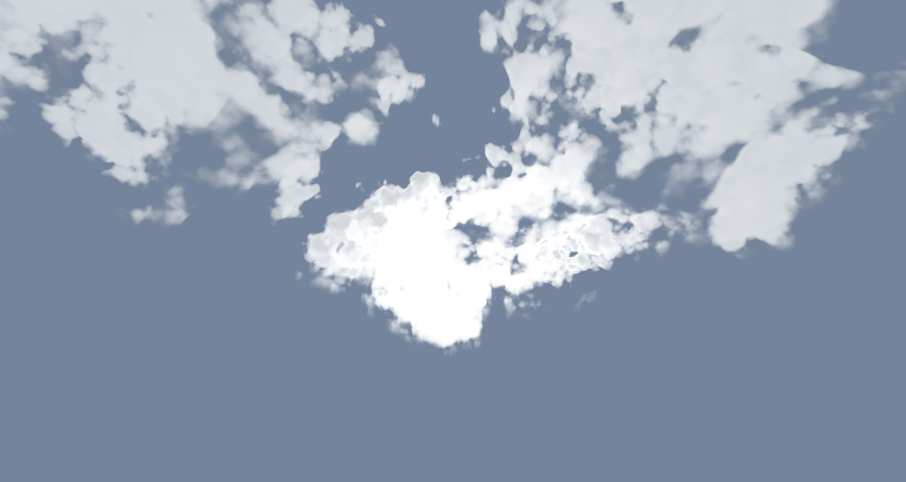
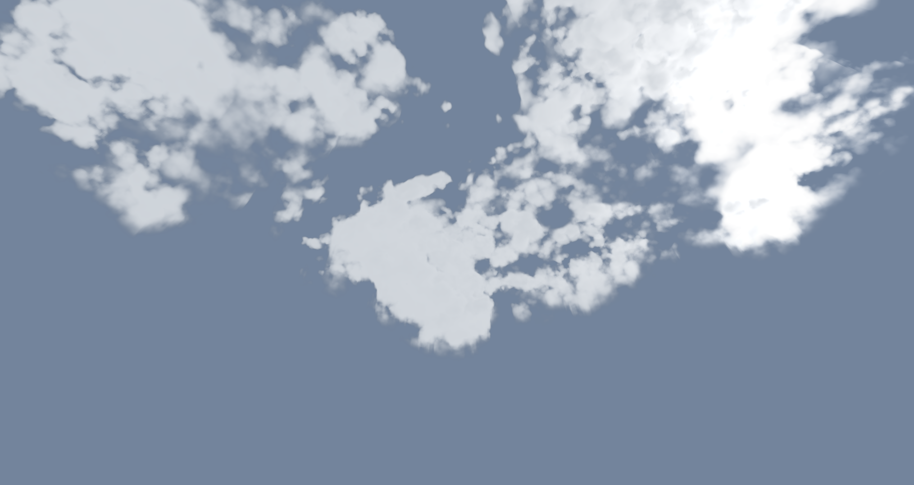
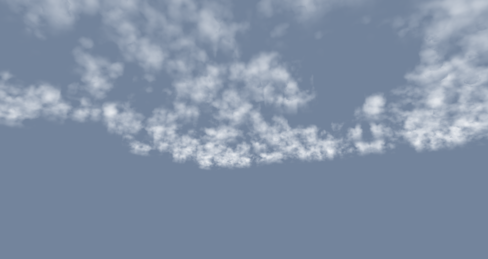
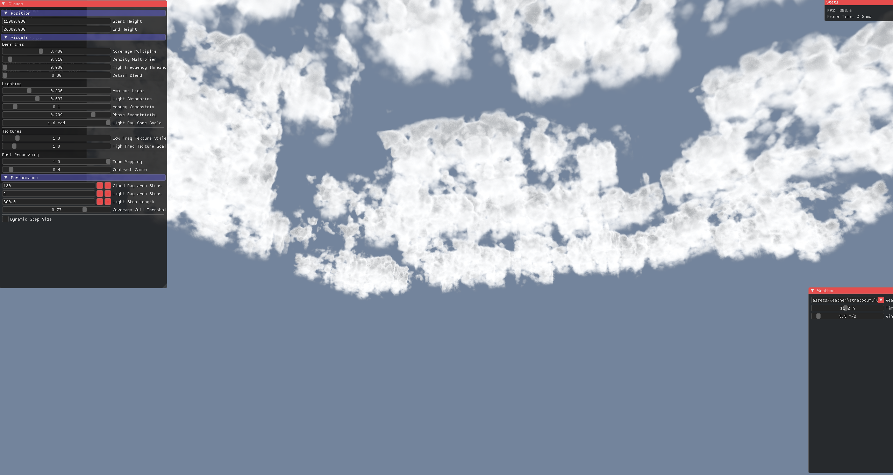
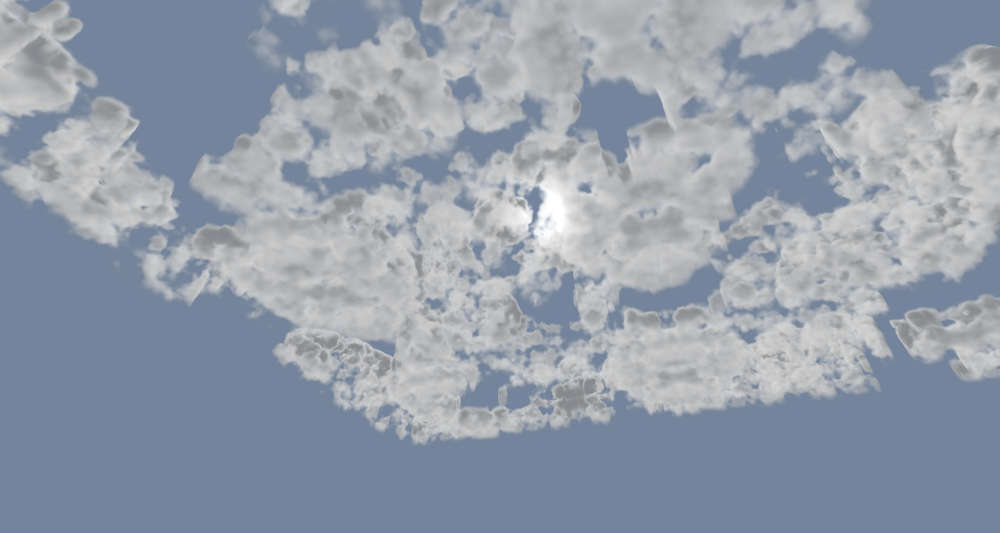

# Sandbox Engine

This is my playground for experimenting with real-time rendering using the WebGPU API.

Currently, it includes examples of volumetric cloud rendering, using raymarching.

## Cloud Rendering Examples

| View                         | Image |
|-----------------------------|-------|
| Above the clouds            |  |
| Almost above view           |  |
| Full cloud volume           |  |
| Henyey-Greenstein 1         |  |
| Henyey-Greenstein 2         |  |
| Inside the clouds           |  |
| Low density clouds          |  |
| Performance view            |  |
| Rain clouds                 |  |
